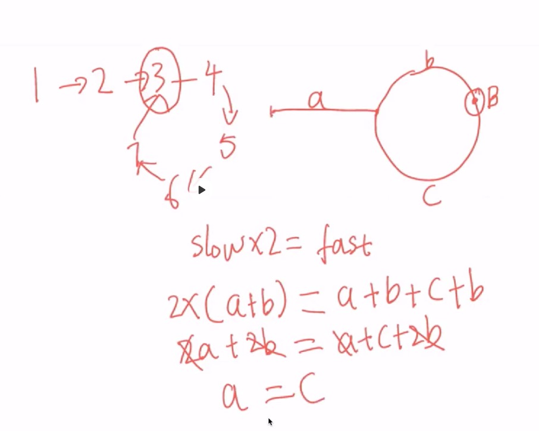

## 链表
### 203移除链表元素
思路：删除链表，找到指定的值，让当前节点的上一个节点的next 指向下一个节点，边界就是head元素
```js
/**
 * Definition for singly-linked list.
 * function ListNode(val) {
 *     this.val = val;
 *     this.next = null;
 * }
 */
/**
 * @param {ListNode} head
 * @param {number} val
 * @return {ListNode}
 */
var removeElements = function(head, val) {
  let cur = head // 当前节点
  let prev = null
  while (cur) {
    if (cur.val === val && cur === head) {  // head要删除 那么 head指向head的next即可
      head = head.next
      cur = head
    } else if (cur.val === val) {
      prev.next = cur.next
      cur = cur.next
    } else {
      prev = cur
      cur = cur.next
    }
  }  
  return head
};
```
优化：因为head是第一位，如果添加一个前节点ele(哨兵元素),他的next指向head，那么就可以直接遍历ele.next，而不用额外考虑head
```js
var removeElements = function(head, val) {
  let ele = {
    next: head
  }
  let cur = ele
  while (cur.next) {
    if (cur.next.val === val) {
      cur.next = cur.next.next
    } else {
      cur = cur.next
    }
  }
  return ele.next
};
```

### 206反转链表
思路：反转链表，如果有prev(前一个节点), cur(当前节点), next(下一个节点),即需要cur.next 指向 prev, prev、cur后移，遍历结束返回prev
```js
/*
 * @lc app=leetcode.cn id=206 lang=javascript
 *
 * [206] 反转链表
 */

// @lc code=start
/**
 * Definition for singly-linked list.
 * function ListNode(val) {
 *     this.val = val;
 *     this.next = null;
 * }
 */
/**
 * @param {ListNode} head
 * @return {ListNode}
 */
var reverseList = function(head) {
  let cur = head
  let prev = null
  while (cur) {
    let next = cur.next
    cur.next = prev // 当前节点的next指向prev
    prev = cur // prev后移
    cur = next // cur后移
  }
  return prev
}

// 使用es6 解构
var reverseList = function(head) {
  let cur = head
  let prev = null
  while (cur) {
    [cur.next, prev, cur] = [prev, cur, cur.next]
  }
  return prev
}
```

### 141环形链表
思路：定义2个指针，fast、show, fast快指针一次跑2个，slow慢指针一次走一个，如果有环，那么fast和slow必然会相遇
```js
/*
 * @lc app=leetcode.cn id=141 lang=javascript
 *
 * [141] 环形链表
 */

// @lc code=start
/**
 * Definition for singly-linked list.
 * function ListNode(val) {
 *     this.val = val;
 *     this.next = null;
 * }
 */

/**
 * @param {ListNode} head
 * @return {boolean}
 */
var hasCycle = function(head) {
  let show = head
  let fast = head
  while (fast && fast.next) {
    fast = fast.next.next
    show = show.next
    if (fast === show) {
      return true
    }
  }
  return false
};

// 使用set或者hash
var hasCycle = function(head) {
  let cache = new Set()
  while (head) {
    if (cache.has(head)) {
      return true
    } else {
      cache.add(head)
      head = head.next
    }
  }
  return false
};
```

### 142环形链表-ii
```js
/*
 * @lc app=leetcode.cn id=142 lang=javascript
 *
 * [142] 环形链表 II
 */

// @lc code=start
/**
 * Definition for singly-linked list.
 * function ListNode(val) {
 *     this.val = val;
 *     this.next = null;
 * }
 */

/**
 * @param {ListNode} head
 * @return {ListNode}
 */
var detectCycle = function(head) {
  let cache = new Set()
  while (head) {
    if (cache.has(head)) {
      return head
    } else {
      cache.add(head)
      head = head.next
    }
  }
  return null
};

// 双指针  快慢和开始
var detectCycle = function(head) {
  let fast = head
  let slow = head
  let start = head
  while (fast && fast.next) {
    fast = fast.next.next
    slow = slow.next
    if (slow === fast) {
      while (slow) {
        if (slow === start) {
          return slow
        }
        slow = slow.next
        start = start.next
      }
    }
  }
  return null
};
```
