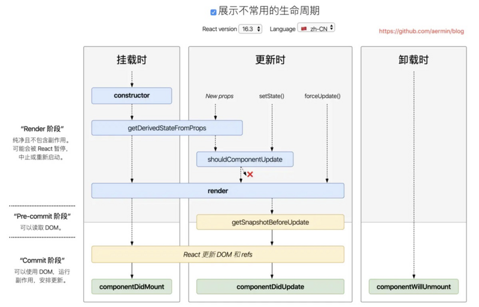

## react-基础

```js
jsx语法

// 变量
const name = 'Tosn'
// jsx
<div><{name}</div> // => <div>Tosn</div>

// function
const person = {
  firstName: 'Zhang',
  lastName: 'San'
}
function formatName (user) {
  return `${user.firstName} ${user.lastName}`
}
// jsx
<div>{formatName(person)}</div> // => <div>Zhang San</div>

// 条件语句
const isLogin = false
// jsx
<div>{isLogin ? '退出登录' : '去登陆'}</div> // => <div>去登陆</div>

// 循环
const list = [0, 1, 2, 3]
// jsx
<ul>
  {
    list.map(item => (
      <li key={item}>{item}</li>
    ))
  }
</ul>
or
<ul>
  {
    list.map(item => {
      return <li key={item}>{item}</li>
    })
  }
</ul>

/**
 * <ul>
 *  <li>0</li>
 *  <li>1</li>
 *  <li>2</li>
 *  <li>3</li>
 * </ul>
*/

// 属性
// jsx
<h4 style={{fontSize: '20px', color: 'red'}}>Test</h4> // => <h4 style="font-size: 20px;color: red">Test</h4>
// 注意 css font-size 在jsx使用驼峰 fontSize 或者加上引号 'font-size'

// 模块化
// index.module.css
.app {
  color: red;
  font-size: 20px;
}
// jsx
import styles from './index.module.css'
<div className={styles.app}>Test</div> // => 避免冲突 模块化后 class或解析成 src_app_字符串
```

## 组件

## redux
* createStore 创建 store
* reducer 初始化、修改状态函数
* getState 获取状态值
* dispatch 提交更新
* subscribe 变更订阅
```js
// 安装引入
npm install redux --save

// src/store/index.js
import { createStore } from 'redux'

function counterReducer (state = 0, action) {
  switch (action.type) {
    case 'ADD': 
      return state + action.value 
    case 'MINUS':
      return state - 1
    default:
      return state
  }
}
const store = createStore(counterReducer)

export default store

// 页面使用
import React, { Component } from 'react';
import store from './store'
class App extends Component {
  componentDidMount () {
    // store变更 强制更新view
    store.subscribe(() => {
      this.forceUpdate()
    })
  }
  render() {
    return (
      <div>
        <h3>redux test</h3>
        <p>{ store.getState() }</p>
        <button onClick={() => store.dispatch({ type: 'ADD', value: 2 })}>add</button>
      </div>
    );
  }
}

export default App;
/**
 * store.subscribe 也可以使用在 入口页面，src/index.js
 * 全局监听store变化重新渲染视图
 */
 import store from './store'
 store.subscribe(() => {
  ReactDOM.render(
    <React.StrictMode>
      <App />
    </React.StrictMode>,
    document.getElementById('root')
  );
})
```

## react-router
```js
npm install react-router-dom --save

import React, { Component } from 'react';
import { BrowserRouter as Router, Link, Route, Switch } from 'react-router-dom'
class App extends Component {
  render() {
    return (
      <Router>
        <Link to="/">首页</Link>
        <Link to="/user">个人中心</Link>
        <Switch>
          <Route exact path="/" 
            // component={Home} 
            render={() => {
              return (
                <div>render Comp</div>
              )
            }}
            // children={() => {
            //   return (
            //     <div>Children comp</div>
            //   )
            // }}
          />
          <Route path="/user" component={User} />
          <Route component={ErrorPage} />
        </Switch>
      </Router>
    );
  }
}

class Home extends React.Component {
  render () {
    return (
      <h1>Home Page</h1>
    )
  }
}

class User extends React.Component {
  render () {
    return (
      <h2>User Info</h2>
    )
  }
}

class ErrorPage extends React.Component {
  render () {
    return (
      <h1>Error Page 404</h1>
    )
  }
}

export default App;
```

路由组件三种引入方式
- component: component  location匹配时渲染
- children: function  不管location是否匹配都会渲染，其他工作方式和render方法一致
- render: function  location匹配时渲染

优先级： children > component > render

精确匹配：Link 加上 <code>exact</code>

唯一匹配： Route外层加上 Switch

## 生命周期

react 16之前


对比图

旧：


新:


V17可能会废弃的三个⽣命周期函数⽤getDerivedStateFromProps替代，⽬前使⽤的话加上UNSAFE_：
- componentWillMount
- componentWillReceiveProps
- componentWillUpdate

引⼊两个新的⽣命周期函数：
- static getDerivedStateFromProps
- getSnapshotBeforeUpdate

如果不想⼿动给将要废弃的⽣命周期添加 UNSAFE_ 前缀，可以⽤下⾯的命令。
```sh
npx react-codemod rename-unsafe-lifecycles <path>
```

**新引⼊的两个⽣命周期函数**
getDerivedStateFromProps
```js
static getDerivedStateFromProps(props, state)
```
<code>getDerivedStateFromProps</code> 会在调⽤ <code>render</code> ⽅法之前调⽤，并且在初始挂载及后续更新时都会被
调⽤。它应返回⼀个对象来更新 state，如果返回 null 则不更新任何内容。

请注意，不管原因是什么，都会在每次渲染前触发此⽅法。这与
UNSAFE_componentWillReceiveProps 形成对⽐，后者仅在⽗组件重新渲染时触发，⽽不是在内部
调⽤ setState 时。

getSnapshotBeforeUpdate
```js
getSnapshotBeforeUpdate(prevProps, prevState)
```
在render之后，在componentDidUpdate之前。

getSnapshotBeforeUpdate() 在最近⼀次渲染输出（提交到 DOM 节点）之前调⽤。它使得组件能
在发⽣更改之前从 DOM 中捕获⼀些信息（例如，滚动位置）。此⽣命周期的任何返回值将作为参数传
递给 componentDidUpdate(prevProps, prevState, snapshot)

**验证⽣命周期**
```js
import React, { Component } from "react";
import PropTypes from "prop-types";
/*
V17可能会废弃的三个⽣命周期函数⽤getDerivedStateFromProps替代，⽬前使⽤的话加上
UNSAFE_：
- componentWillMount
- componentWillReceiveProps
- componentWillUpdate
 */
export default class LifeCyclePage extends Component {
 static defaultProps = {
 msg: "omg"
 };
 static propTypes = {
 msg: PropTypes.string.isRequired
 };
 constructor(props) {
 super(props);
 this.state = {
 count: 0,
 };
 console.log("constructor", this.state.count);
 }
 static getDerivedStateFromProps(props, state) {
 // getDerivedStateFromProps 会在调⽤ render ⽅法之前调⽤，
 //并且在初始挂载及后续更新时都会被调⽤。
开课吧web全栈架构师
 //它应返回⼀个对象来更新 state，如果返回 null 则不更新任何内容。
 const { count } = state;
 console.log("getDerivedStateFromProps", count);
 return count < 5 ? null : { count: 0 };
 }
 //在render之后，在componentDidUpdate之前。
 getSnapshotBeforeUpdate(prevProps, prevState, snapshot) {
 const { count } = prevState;
 console.log("getSnapshotBeforeUpdate", count);
 return null;
 }
 /* UNSAFE_componentWillMount() {
 //不推荐，将会被废弃
 console.log("componentWillMount", this.state.count);
 } */
 componentDidMount() {
 console.log("componentDidMount", this.state.count);
 }
 componentWillUnmount() {
 //组件卸载之前
 console.log("componentWillUnmount", this.state.count);
 }
 /* UNSAFE_componentWillUpdate() {
 //不推荐，将会被废弃
 console.log("componentWillUpdate", this.state.count);
 } */
 componentDidUpdate() {
 console.log("componentDidUpdate", this.state.count);
 }
 shouldComponentUpdate(nextProps, nextState) {
 const { count } = nextState;
 console.log("shouldComponentUpdate", count, nextState.count);
 return count !== 3;
 }
 setCount = () => {
 this.setState({
 count: this.state.count + 1,
 });
 };
 render() {
 const { count } = this.state;
 console.log("render", this.state);
 return (
 <div>
 <h1>我是LifeCycle⻚⾯</h1>
 <p>{count}</p>
开课吧web全栈架构师
 <button onClick={this.setCount}>改变count</button>
 {/* {!!(count % 2) && <Foo />} */}
 <Child count={count} />
 </div>
 );
 }
}
class Child extends Component {
 UNSAFE_componentWillReceiveProps(nextProps) {
 //不推荐，将会被废弃
 // UNSAFE_componentWillReceiveProps() 会在已挂载的组件接收新的 props 之前被调⽤
 console.log("Foo componentWillReceiveProps");
 }
 componentWillUnmount() {
 //组件卸载之前
 console.log(" Foo componentWillUnmount");
 }
 render() {
 return (
 <div
 style={{ border: "solid 1px black", margin: "10px", padding: "10px" }}
 >
 我是Foo组件
 <div>Foo count: {this.props.count}</div>
 </div>
 );
 }
}
```

## Context
[官方context](https://zh-hans.reactjs.org/docs/context.html)
1. 创建context实例 ThemeContext = React.createContext('value')
2. 组件中应用context(ThemeContext)，挂在需要往子组件传递的值value
3. 子组件获取value
   - class 组件， static contextType = ThemeContext(context实例), this.context即为context传递下来的值
   - 函数式组件，使用useContext 获取context实例的值， const context = useContext(ThemeContext)
```js
import React, { Component, useContext } from 'react'
const ThemeContext = React.createContext('dark')
const Provider = ThemeContext.Provider

class Child extends Component {
  static contextType = ThemeContext
  render() { 
    return ( 
      <div className={this.context}>child page
        <div className="childBox">
          { this.props.children }
        </div>
      </div>
    );
  }
}

function Fchild () {
  const context = useContext(ThemeContext)
  return (
    <div className={context}>function context</div>
  )
}

export default class HocPage extends Component {
  render() {
    return (
      <div>
        <Provider value="light">
          <Child>
            <Fchild></Fchild>
          </Child>
        </Provider>
      </div>
    )
  }
}

```

## 高阶组件
函数式组件，接受一个组件，返回一个新的组件

```js
import React, { Component } from 'react'

const Child = (props) => {
  return <div>hello {props.name}</div>
}

const foo = Comp => props => {
  return (
    <div style={{border: "1px solid red", padding: "20px"}}>
      <Comp {...props}></Comp>
    </div>
  )
}

const Foo = foo(foo(Child))

// 装饰器用法 需要先安装插件及配置装饰器

@foo
class Child2 extends Component {
  render() { 
    return ( 
      <div>Child 2 {this.props.name}</div>
     );
  }
}


export default class HocPage extends Component {
  render() {
    return (
      <div>
        <Foo name="Tosn"/>
      </div>
    )
  }
}

```